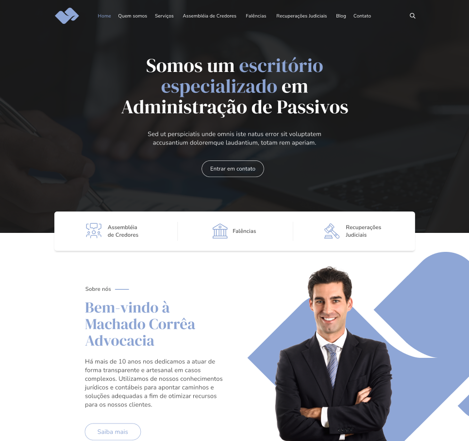
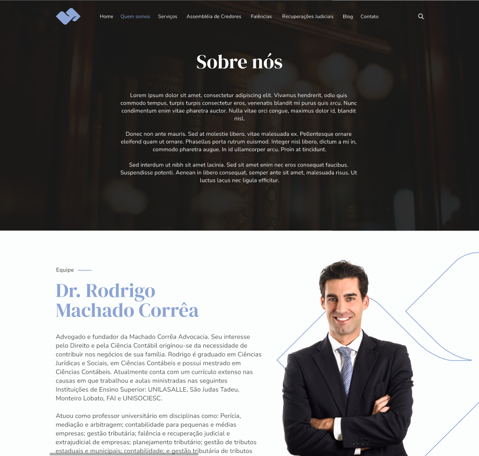
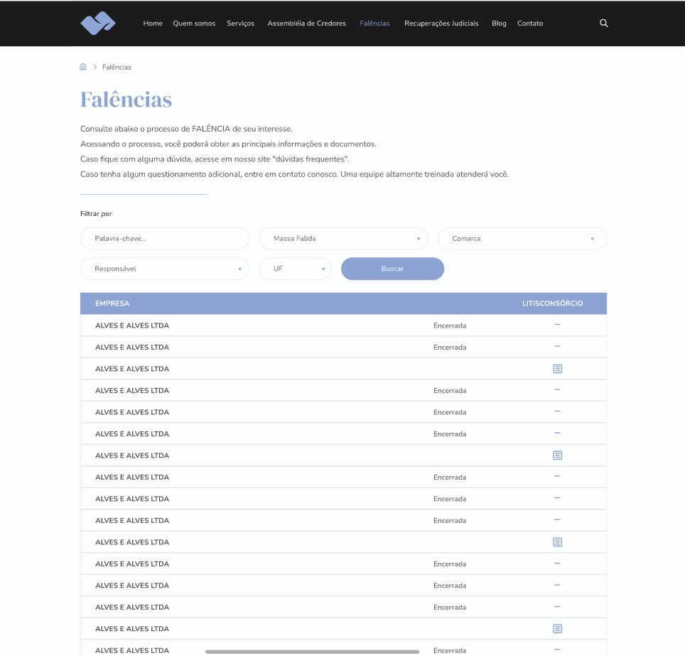
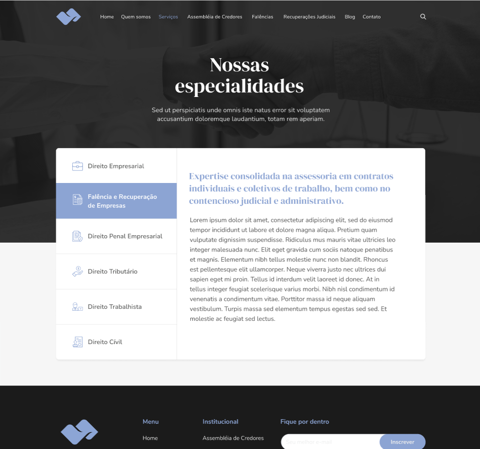
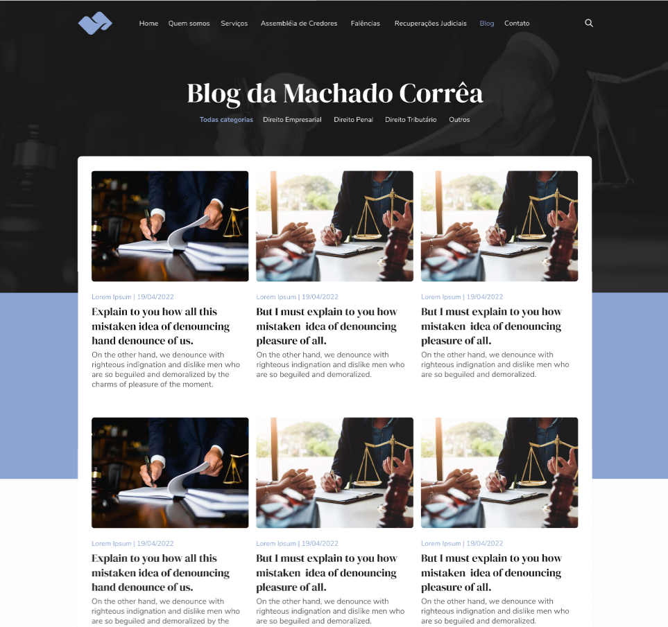

# Machado Corrêa Advocacia

Aplicativo desenvolvido em Nuxt apra a Barbosa Software como Freelancer, este projeto foram aplicados `Javascript`, `TailwindCSS`, `Nuxt.js`, também usei bastante uma biblioteca de componentes chamada `FlowbiteUI`, que consome `TailwindCSS` pra construções dos componentes, a aplicação também é `responsiva`.

*Projeto ainda em Desenvolvimento*

# Executando...

 Abaixo veja algumas imagens do site.

### Home Page



### Sobre nós ?



### Manu - Falência



### Menu - Especialidades



### Blog




# Instalação

1. Com o Node.js e o Nuxt.js instalado na sua máquina, rode os comandos
2. Faça o [Download](https://www.nerdfonts.com/font-downloads) do projeto contigo neste repositório e o abra no editor de texto de sua preferência.

    ```sh
    npm install
    npm run serve
    ```

# Autores

João Pedro Souza
